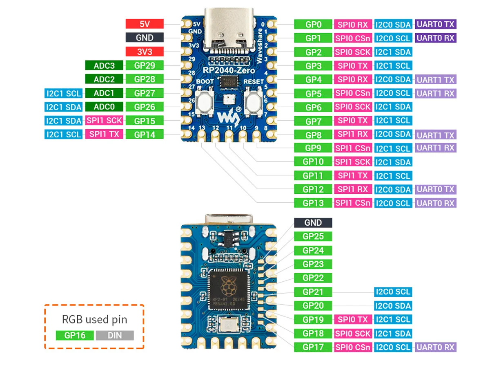

# Rubber Ducky for RP2040 Zero :duck:

Adaptation of [pico-ducky](https://github.com/dbisu/pico-ducky) from **dbisu** for RP2040 Zero.

## Installation

- Hold the boot button while plugging the board to the PC. 
- Drag and drop the *uf2* file (adafruit-circuitpython-waveshare_rp2040_zero-en_US-8.2.8).
- It will reset. After this copy all contents in the *src* folder into the board.
- It should now work :)

## More info

The pinout for this board is the following.

For the stealth mode, add a jumper to pin GP15 to GND.

If anything goes wrong in the instalation, you can factory reset the board by holding the boot button and drag and dropping the *flash_nuke.uf2*.

## TO DO:

- Allow more than one *payload*.
- Make 3D printed case design.
- Control by stealth mode by switch.
- Select *payload* with input.